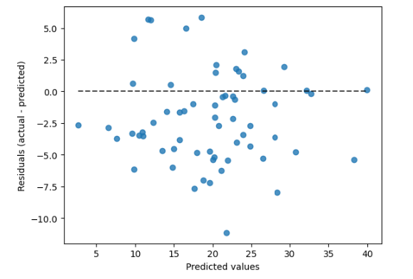
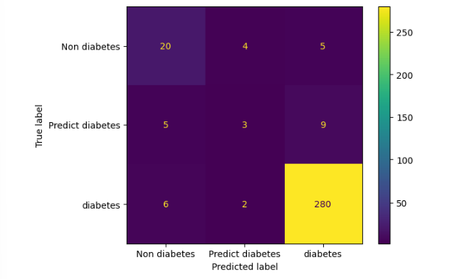

# CS50 FINAL PROJECT 

This is a machine learning repository, applying some basic models to datasets that I find interesting.

## Digit recognition

The first dataset analysis included is, digit handwriting recognition. 
In this project, I'm gonna analyze a dataset of number recognition, in order to build a model capable of identifying a number with an image as an output. <br>
The first thing we are going to do is import all the necessary things for this project including the dataset and all the Python libraries to use.
<br>
The dataset is provided by a library in python called **scikit learn**, which is a Python library dedicated to machine learning. We are gonna use the digits dataset. 

```
import numpy as np
import pandas as pd
import matplotlib.pyplot as plt
import sklearn
from sklearn.preprocessing import scale
from sklearn.datasets import load_digits
from sklearn.cluster import KMeans
from sklearn import metrics
from sklearn.pipeline import make_pipeline
```
### Evaluating performance 

<ul>
    <li> Name: k-means++ <br> 
    <li>Time: 0.7189590930938721 <br>
    <li>inertia: 69519.937 <br>
    <li>Homogeneity score: 0.611 <br>
    <li>Completness score: 0.659 <br>
    <li>V measure score: 0.634 <br>
    <li>Adjusted rand score: 0.480 <br>
    <li>Adjusted rand score: 0.630 <br>
    <li>Silhouette score: 0.135 <br>
</ul>

## Model for calculating bodyfat
**[DATASET](https://www.kaggle.com/datasets/simonezappatini/body-fat-extended-dataset)** <br>

It is a dataset containing body measurements for 436 people and the corresponding bodyfat value. With this dataset, I feed the data into a Bayesian ridge model and a linear model for calculating the bodyfat index based on:

<ol>
    <li> Age </li>
    <li> Weight </li>
    <li> Height </li>
    <li> Neck width </li>
    <li> Chest width </li>
    <li> Abdomen </li>
    <li> Hip </li>
    <li> Thigh </li>
    <li> Knee </li>
    <li> Ankle </li>
    <li> Biceps </li>
    <li> Forearm </li>
    <li> Wrist </li>
</ol>

### Results 

The Bayesian Ridge R2 score was : 0.739 <br>
The Linear Regression score R2 was: 0.738

The residuals vs Predicted values graph is: 



## Predicting diabetes

Diabetes is an opportune disease that has large wealth of data available and has with it huge complications. There is a need for a better and more accurate approach to the diagnosis of the disease.

The data were collected from the Iraqi society, as they data were acquired from the laboratory of Medical City Hospital and (the Specializes Center for Endocrinology and Diabetes-Al-Kindy Teaching Hospital)The data that have been entered initially into the system are: 

<ul>
<li> No. of Patient 
<li> Sugar Level Blood 
<li> Age 
<li> Gender 
<li> Creatinine ratio(Cr) 
<li> Body Mass Index (BMI) 
<li> Urea, Cholesterol (Chol) 
<li> Fasting lipid profile 
<li> including total 
<li> LDL 
<li> VLDL
<li> Triglycerides(TG) 
<li> HDL Cholesterol 
<li> HBA1C
<li> Class (the patient's diabetes disease class may be Diabetic, Non-Diabetic, or Predict-Diabetic).
</ul>

<br>
[DATASET](https://www.kaggle.com/datasets/aravindpcoder/diabetes-dataset).

### Results 

The model that was applied was a K neighbors classifier, for classifying the data into 3 classes.  DIabetic, Non - Diabetic or predict-Diabetic.

We can visualize the results with a confusion matrix that displays the correct predicted values as well as the incorrect ones. 



Other useful metrics are accuracy, precision, recall and F1 score. 

              precision    recall  f1-score   support

           0       0.65      0.69      0.67        29
           1       0.33      0.18      0.23        17
           2       0.95      0.97      0.96       288

    accuracy                           0.91       334

**Accuracy** is a Classification measure in Machine Learning that represents a percentage of correct predictions made by a model. <br>

**Precision** is the percentage of positives that were actually positives.

**Recall** is the percentage of how many positive results our model captures from the real total of positives. 
